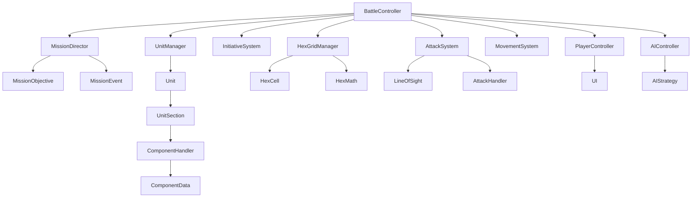

# Turn-Based 3D Tactical Game Architecture (BattleTech-inspired)

## Overview
This is a Godot-based turn-based 3D tactical game inspired by BattleTech, featuring a hex-grid battlefield, unit-based combat, and mission objectives. The architecture follows a clear separation of concerns with a centralized BattleController as the orchestrator.

## Core Architecture Components

### 1. BattleController (Central Orchestrator)
- **Role**: Sole System Operator
- **Responsibilities**:
  - Manages turn-based combat flow
 - Coordinates between all game systems
  - Handles victory/defeat conditions
  - Processes unit actions (movement, attacks, abilities)
  - Acts as the central hub for all game state transitions

### 2. Mission System
- **MissionDirector**: Central mission logic controller
  - Manages mission objectives and win/lose conditions
  - Connects to BattleController for combat state awareness
  - Handles mission events and progression
- **MissionObjective**: Defines specific mission goals
  - Tracks completion status (PENDING, ACTIVE, COMPLETED, FAILED)
 - Supports primary and secondary objectives
  - Monitors unit states for completion conditions
- **MissionEvent**: Abstract base class for mission events
  - Supports instant, timed, and recurring events
  - Priority-based execution system

### 3. Unit System
- **Unit**: Top-level game entity representing a BattleTech unit
  - Contains multiple UnitSection children
  - Manages mobility types (BIPEDAL, WHEELED, HOVER, TRACKED, AERIAL)
  - Handles team affiliation and initiative
- **UnitSection**: Represents individual unit parts (CTorso, LArm, etc.)
  - Manages armor and structure damage
  - Contains components and handles critical damage
- **ComponentHandler/ComponentData**: Modular component system
  - Decoupled data and handler pattern
  - Supports critical components and health tracking
- **UnitManager**: Unit lifecycle management
  - Handles spawning, tracking, and destruction
  - Maintains active and destroyed unit registries

### 4. Hex Grid System
- **HexGridManager**: Centralized hex-based battlefield management
  - Manages hex cell grid and unit positions
  - Implements directional pathfinding with A*
  - Handles movement costs based on terrain and elevation
  - Supports different mobility types with varying costs
- **HexCell**: Individual hex grid cell
  - Contains terrain data and elevation information
  - Tracks units occupying the cell
- **HexMath**: Utility for hex-based calculations
  - Handles coordinate conversions and movement rules

### 5. Combat System
- **AttackSystem**: Manages attack resolution
 - Validates attack parameters (range, line of sight)
  - Delegates to specific attack handlers (Standard, Cluster)
  - Handles weapon-specific mechanics
- **MovementSystem**: Manages unit movement
  - Calculates movement costs and validates paths
  - Handles different mobility types and terrain interactions
- **LineOfSight**: Handles visibility and targeting
  - Validates clear attack paths between units
  - Implements BattleTech-specific line of sight rules

### 6. Turn Management
- **InitiativeSystem**: Manages turn order
  - Calculates initiative based on speed and agility
  - Handles tiebreakers and round resets
  - Maintains turn order queue
- **HeatSystem**: Tracks unit heat levels
  - Manages heat generation and dissipation
  - Implements BattleTech heat mechanics

### 7. AI System
- **BaseController**: Abstract controller base class
  - Defines interface for both AI and player controllers
  - Manages unit turn lifecycle (begin, process, end)
- **PlayerController**: Handles player input
  - Processes UI-driven actions (movement, attacks)
  - Validates and forwards actions to BattleController
- **AIController**: Manages AI behavior
  - Implements AI strategies via AIStrategy resources
  - Generates and executes plans automatically
- **AIStrategy**: Defines AI behavior patterns
  - Calculates movement and combat decisions
 - Supports different tactical approaches

### 8. UI System
- **BattleUIController**: Main UI coordinator
  - Manages battle interface elements
  - Responds to game state changes
- **UnitStatusPanel**: Displays unit status information
- **CombatLog**: Tracks and displays combat events
- **InitiativeUITracker**: Shows turn order information

## System Flow Diagram

This architecture provides a solid foundation for a turn-based tactical game with clear separation of concerns and adherence to the project's architectural principles.