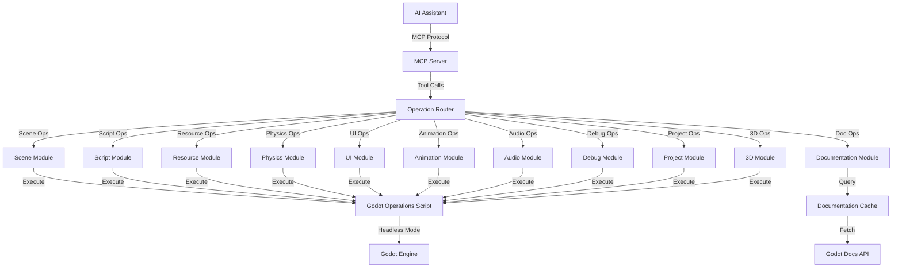

# Design Document

## Overview

This document describes the architectural design for extending the Godot MCP server into a full-featured game development assistant. The design is based on the existing architecture with a bundled GDScript approach and extends it to support all requirements.

### Target Version: Godot 4.5+

The design targets Godot 4.5 and above, utilizing modern APIs and capabilities:
- **UID System**: Full support for the unique resource identifier system (introduced in 4.4, stabilized in 4.5)
- **Enhanced GDScript**: Use of improved GDScript 2.0 with typing and new features
- **Modern Node Types**: Support for all modern node types (CharacterBody3D, GPUParticles3D, etc.)
- **Compositor Effects**: Support for the new compositor effects system
- **Improved Physics**: Use of the improved Godot 4.5+ physics engine

### Key Design Principles

1. **Modularity**: Each functional area (scenes, scripts, physics, etc.) is implemented as a separate module
2. **Extensibility**: Architecture allows easy addition of new operations without changing core logic
3. **Security**: All operations are validated and sanitized before execution
4. **Modernity**: Use only Godot 4.5+ API without legacy support
5. **Documentation**: Integration with official Godot 4.5+ documentation for contextual help

## Architecture

### High-Level Architecture



### Component Architecture

#### 1. MCP Server Layer (TypeScript)

**Existing Components:**
- `GodotServer` - main server class
- `executeOperation()` - operation execution through Godot
- `detectGodotPath()` - Godot path detection
- Parameter normalization - snake_case ↔ camelCase conversion

**New Components:**
- `OperationRegistry` - registry of all available operations
- `ValidationLayer` - parameter validation before execution
- `CacheManager` - caching of results and documentation
- `VersionManager` - Godot version compatibility management

#### 2. Godot Operations Script Layer (GDScript)

**Existing Operations:**
- `create_scene` - scene creation
- `add_node` - node addition
- `load_sprite` - sprite loading
- `export_mesh_library` - MeshLibrary export
- `save_scene` - scene saving
- `get_uid` - UID retrieval
- `resave_resources` - resource resaving

**New Operations (to be added):**
- Scene operations: `remove_node`, `modify_node`, `duplicate_node`, `query_node`
- Script operations: `create_script`, `attach_script`, `validate_script`, `get_node_methods`
- Resource operations: `import_asset`, `create_resource`, `list_assets`, `configure_import`
- Signal operations: `create_signal`, `connect_signal`, `list_signals`, `disconnect_signal`
- Physics operations: `add_physics_body`, `configure_physics`, `setup_collision_layers`
- UI operations: `create_ui_element`, `apply_theme`, `setup_layout`
- Animation operations: `create_animation_player`, `add_keyframes`, `setup_animation_tree`
- Audio operations: `add_audio_player`, `configure_audio_bus`, `setup_3d_audio`
- Project operations: `update_project_settings`, `configure_input_map`, `setup_autoload`
- 3D operations: `create_3d_scene`, `import_3d_model`, `setup_materials`, `configure_environment`

## Components and Interfaces

### 1. Scene Management Module

#### Interface
```typescript
interface SceneOperations {
  createScene(params: CreateSceneParams): Promise<SceneResult>;
  addNode(params: AddNodeParams): Promise<NodeResult>;
  removeNode(params: RemoveNodeParams): Promise<OperationResult>;
  modifyNode(params: ModifyNodeParams): Promise<NodeResult>;
  duplicateNode(params: DuplicateNodeParams): Promise<NodeResult>;
  queryNode(params: QueryNodeParams): Promise<NodeInfo>;
}

interface CreateSceneParams {
  projectPath: string;
  scenePath: string;
  rootNodeType: string;
  template?: string; // Preset templates (2D platformer, 3D FPS, etc.)
}

interface ModifyNodeParams {
  projectPath: string;
  scenePath: string;
  nodePath: string;
  properties: Record<string, any>;
  transform?: Transform2D | Transform3D;
}
```

#### GDScript Implementation (Godot 4.5+)
```gdscript
func modify_node(params: Dictionary) -> Dictionary:
    # Load scene with UID support
    var scene_path := params.scene_path as String
    var scene: PackedScene = load(scene_path)
    if not scene:
        return create_error("Failed to load scene")
    
    var scene_root: Node = scene.instantiate()
    var node: Node = get_node_by_path(scene_root, params.node_path)
    
    if not node:
        return create_error("Node not found: " + params.node_path)
    
    # Apply properties with type checking (GDScript 2.0)
    var properties := params.properties as Dictionary
    for property in properties:
        if property in node:
            node.set(property, properties[property])
        else:
            push_warning("Property not found: " + property)
    
    # Apply transform if provided (using modern Transform2D/Transform3D)
    if params.has("transform"):
        apply_transform(node, params.transform)
    
    # Save with UID preservation
    var packed_scene := PackedScene.new()
    packed_scene.pack(scene_root)
    var error := ResourceSaver.save(packed_scene, scene_path)
    
    return {"success": error == OK, "node_path": params.node_path}
```

### 2. Script Management Module

#### Interface
```typescript
interface ScriptOperations {
  createScript(params: CreateScriptParams): Promise<ScriptResult>;
  attachScript(params: AttachScriptParams): Promise<OperationResult>;
  validateScript(params: ValidateScriptParams): Promise<ValidationResult>;
  getNodeMethods(params: GetMethodsParams): Promise<MethodInfo[]>;
}

interface CreateScriptParams {
  projectPath: string;
  scriptPath: string;
  template: 'node' | 'resource' | 'custom';
  baseClass?: string;
  signals?: string[];
  exports?: ExportVariable[];
}

interface ValidationResult {
  valid: boolean;
  errors: ScriptError[];
  warnings: ScriptWarning[];
}

interface ScriptError {
  line: number;
  column: number;
  message: string;
  type: 'syntax' | 'semantic' | 'runtime';
}
```

#### GDScript Implementation (Godot 4.5+)
```gdscript
func create_script(params: Dictionary) -> Dictionary:
    var script_content := generate_script_template(params)
    var script_path := params.script_path as String
    
    # Use modern FileAccess API (Godot 4.x)
    var file := FileAccess.open(script_path, FileAccess.WRITE)
    if not file:
        return create_error("Cannot create file: " + FileAccess.get_open_error())
    
    file.store_string(script_content)
    file.close()
    
    # Validate using GDScript parser (Godot 4.5+)
    var validation := validate_script_syntax(script_path)
    return validation

func validate_script(params: Dictionary) -> Dictionary:
    var script_path := params.script_path as String
    var script := load(script_path) as GDScript
    
    if not script:
        return {
            "valid": false, 
            "errors": [{"message": "Failed to load script", "line": 0}]
        }
    
    # Use GDScript parser for detailed error reporting (Godot 4.5+)
    var parser := GDScriptParser.new()
    var parse_result := parser.parse(script.source_code)
    
    var errors: Array[Dictionary] = []
    if parse_result != OK:
        for error in parser.get_errors():
            errors.append({
                "line": error.line,
                "column": error.column,
                "message": error.message,
                "type": "syntax"
            })
    
    return {
        "valid": errors.is_empty(), 
        "errors": errors,
        "warnings": parser.get_warnings()
    }
```

### 3. Resource Management Module

#### Interface
```typescript
interface ResourceOperations {
  importAsset(params: ImportAssetParams): Promise<ImportResult>;
  createResource(params: CreateResourceParams): Promise<ResourceResult>;
  listAssets(params: ListAssetsParams): Promise<AssetInfo[]>;
  configureImport(params: ConfigureImportParams): Promise<OperationResult>;
}

interface ImportAssetParams {
  projectPath: string;
  assetPath: string;
  importSettings?: {
    type: 'texture' | 'audio' | 'model' | 'font';
    compression?: string;
    mipmaps?: boolean;
    filter?: boolean;
  };
}

interface AssetInfo {
  path: string;
  type: string;
  size: number;
  dependencies: string[];
  uid?: string;
}
```

### 4. Signal System Module

#### Interface
```typescript
interface SignalOperations {
  createSignal(params: CreateSignalParams): Promise<OperationResult>;
  connectSignal(params: ConnectSignalParams): Promise<OperationResult>;
  listSignals(params: ListSignalsParams): Promise<SignalInfo[]>;
  disconnectSignal(params: DisconnectSignalParams): Promise<OperationResult>;
}

interface ConnectSignalParams {
  projectPath: string;
  scenePath: string;
  sourceNodePath: string;
  signalName: string;
  targetNodePath: string;
  methodName: string;
  binds?: any[];
  flags?: number;
}

interface SignalInfo {
  name: string;
  parameters: ParameterInfo[];
  connections: ConnectionInfo[];
}
```

#### GDScript Implementation (Godot 4.5+)
```gdscript
func connect_signal(params: Dictionary) -> Dictionary:
    var scene_path := params.scene_path as String
    var scene: PackedScene = load(scene_path)
    var scene_root := scene.instantiate()
    
    var source := get_node_by_path(scene_root, params.source_node_path)
    var target := get_node_by_path(scene_root, params.target_node_path)
    
    if not source or not target:
        return create_error("Node not found")
    
    # Validate signal exists (Godot 4.5+ API)
    var signal_name := params.signal_name as StringName
    if not source.has_signal(signal_name):
        return create_error("Signal not found: " + signal_name)
    
    # Validate method exists
    var method_name := params.method_name as StringName
    if not target.has_method(method_name):
        return create_error("Method not found: " + method_name)
    
    # Get signal info for validation (Godot 4.5+)
    var signal_list := source.get_signal_list()
    var signal_info: Dictionary
    for sig in signal_list:
        if sig.name == signal_name:
            signal_info = sig
            break
    
    # Validate method signature matches signal
    var method_list := target.get_method_list()
    var method_info: Dictionary
    for method in method_list:
        if method.name == method_name:
            method_info = method
            break
    
    # Connect using modern Callable API (Godot 4.x)
    var callable := Callable(target, method_name)
    var flags := params.get("flags", 0) as int
    
    if params.has("binds"):
        var binds := params.binds as Array
        callable = callable.bindv(binds)
    
    var error := source.connect(signal_name, callable, flags)
    if error != OK:
        return create_error("Failed to connect signal: " + str(error))
    
    # Save scene with connection metadata
    var packed_scene := PackedScene.new()
    packed_scene.pack(scene_root)
    ResourceSaver.save(packed_scene, scene_path)
    
    return {"success": true, "connection": signal_name + " -> " + method_name}
```

### 5. Physics Module (Godot 4.5+ Physics)

#### Interface
```typescript
interface PhysicsOperations {
  addPhysicsBody(params: AddPhysicsBodyParams): Promise<NodeResult>;
  configurePhysics(params: ConfigurePhysicsParams): Promise<OperationResult>;
  setupCollisionLayers(params: CollisionLayersParams): Promise<OperationResult>;
}

interface AddPhysicsBodyParams {
  projectPath: string;
  scenePath: string;
  parentNodePath: string;
  // Godot 4.5+ physics body types
  bodyType: 'CharacterBody2D' | 'RigidBody2D' | 'StaticBody2D' | 'AnimatableBody2D' |
            'CharacterBody3D' | 'RigidBody3D' | 'StaticBody3D' | 'AnimatableBody3D';
  collisionShape: {
    // Godot 4.5+ shape types
    type: 'RectangleShape2D' | 'CircleShape2D' | 'CapsuleShape2D' | 'ConvexPolygonShape2D' |
          'BoxShape3D' | 'SphereShape3D' | 'CapsuleShape3D' | 'CylinderShape3D' | 'ConvexPolygonShape3D';
    size?: Vector2 | Vector3;
    radius?: number;
    height?: number;
  };
  physicsProperties?: {
    // RigidBody specific (Godot 4.5+)
    mass?: number;
    physics_material?: {
      friction?: number;
      bounce?: number;
      absorbent?: boolean; // New in Godot 4.5+
    };
    gravity_scale?: number;
    linear_damp?: number;
    angular_damp?: number;
    // CharacterBody specific
    motion_mode?: 'MOTION_MODE_GROUNDED' | 'MOTION_MODE_FLOATING';
    platform_on_leave?: 'PLATFORM_ON_LEAVE_ADD_VELOCITY' | 'PLATFORM_ON_LEAVE_ADD_UPWARD_VELOCITY' | 'PLATFORM_ON_LEAVE_DO_NOTHING';
  };
}
```

#### GDScript Implementation (Godot 4.5+)
```gdscript
func add_physics_body(params: Dictionary) -> Dictionary:
    var scene: PackedScene = load(params.scene_path)
    var scene_root := scene.instantiate()
    var parent := get_node_by_path(scene_root, params.parent_node_path)
    
    # Create physics body using Godot 4.5+ API
    var body_type := params.body_type as String
    var body: PhysicsBody2D = ClassDB.instantiate(body_type)
    body.name = params.get("name", body_type)
    
    # Create collision shape
    var collision_shape: CollisionShape2D = CollisionShape2D.new()
    collision_shape.name = "CollisionShape"
    
    # Create shape resource (Godot 4.5+ shapes)
    var shape_type := params.collision_shape.type as String
    var shape: Shape2D = ClassDB.instantiate(shape_type)
    
    # Configure shape based on type
    match shape_type:
        "RectangleShape2D":
            shape.size = params.collision_shape.get("size", Vector2(32, 32))
        "CircleShape2D":
            shape.radius = params.collision_shape.get("radius", 16.0)
        "CapsuleShape2D":
            shape.radius = params.collision_shape.get("radius", 16.0)
            shape.height = params.collision_shape.get("height", 32.0)
    
    collision_shape.shape = shape
    body.add_child(collision_shape)
    collision_shape.owner = scene_root
    
    # Configure physics properties (Godot 4.5+)
    if params.has("physics_properties"):
        var props := params.physics_properties as Dictionary
        
        if body is RigidBody2D:
            if props.has("mass"):
                body.mass = props.mass
            if props.has("gravity_scale"):
                body.gravity_scale = props.gravity_scale
            if props.has("linear_damp"):
                body.linear_damp = props.linear_damp
            if props.has("angular_damp"):
                body.angular_damp = props.angular_damp
            
            # Physics material (Godot 4.5+)
            if props.has("physics_material"):
                var mat := PhysicsMaterial.new()
                var mat_props := props.physics_material as Dictionary
                mat.friction = mat_props.get("friction", 1.0)
                mat.bounce = mat_props.get("bounce", 0.0)
                mat.absorbent = mat_props.get("absorbent", false)
                body.physics_material_override = mat
        
        elif body is CharacterBody2D:
            if props.has("motion_mode"):
                body.motion_mode = CharacterBody2D[props.motion_mode]
            if props.has("platform_on_leave"):
                body.platform_on_leave = CharacterBody2D[props.platform_on_leave]
    
    parent.add_child(body)
    body.owner = scene_root
    
    # Save scene
    var packed_scene := PackedScene.new()
    packed_scene.pack(scene_root)
    ResourceSaver.save(packed_scene, params.scene_path)
    
    return {"success": true, "body_path": parent.get_path_to(body)}
```

### 6. UI Module

#### Interface
```typescript
interface UIOperations {
  createUIElement(params: CreateUIElementParams): Promise<NodeResult>;
  applyTheme(params: ApplyThemeParams): Promise<OperationResult>;
  setupLayout(params: SetupLayoutParams): Promise<OperationResult>;
}

interface CreateUIElementParams {
  projectPath: string;
  scenePath: string;
  parentNodePath: string;
  elementType: 'Button' | 'Label' | 'TextEdit' | 'Panel' | 'Container';
  properties: {
    text?: string;
    size?: Vector2;
    anchors?: {
      left?: number;
      top?: number;
      right?: number;
      bottom?: number;
    };
  };
}
```

### 7. Animation Module

#### Interface
```typescript
interface AnimationOperations {
  createAnimationPlayer(params: CreateAnimationPlayerParams): Promise<NodeResult>;
  addKeyframes(params: AddKeyframesParams): Promise<OperationResult>;
  setupAnimationTree(params: SetupAnimationTreeParams): Promise<OperationResult>;
}

interface AddKeyframesParams {
  projectPath: string;
  scenePath: string;
  animationPlayerPath: string;
  animationName: string;
  track: {
    nodePath: string;
    property: string;
    keyframes: Array<{
      time: number;
      value: any;
      transition?: number;
    }>;
  };
}
```

### 8. Audio Module

#### Interface
```typescript
interface AudioOperations {
  addAudioPlayer(params: AddAudioPlayerParams): Promise<NodeResult>;
  configureAudioBus(params: ConfigureAudioBusParams): Promise<OperationResult>;
  setup3DAudio(params: Setup3DAudioParams): Promise<NodeResult>;
}

interface AddAudioPlayerParams {
  projectPath: string;
  scenePath: string;
  parentNodePath: string;
  playerType: 'AudioStreamPlayer' | 'AudioStreamPlayer2D' | 'AudioStreamPlayer3D';
  audioPath: string;
  autoplay?: boolean;
  volume?: number;
  bus?: string;
}
```

### 9. Debug Module

#### Interface
```typescript
interface DebugOperations {
  runWithDebug(params: RunDebugParams): Promise<DebugSession>;
  runScene(params: RunSceneParams): Promise<SceneRunResult>;
  setBreakpoint(params: SetBreakpointParams): Promise<OperationResult>;
  getVariables(params: GetVariablesParams): Promise<VariableInfo[]>;
  profilePerformance(params: ProfileParams): Promise<ProfileResult>;
  toggleDebugDraw(params: ToggleDebugDrawParams): Promise<OperationResult>;
  remoteTreeDump(params: RemoteTreeDumpParams): Promise<TreeDumpResult>;
  captureScreenshot(params: CaptureScreenshotParams): Promise<OperationResult>;
  captureMovie(params: CaptureMovieParams): Promise<OperationResult>;
  listMissingAssets(params: ListMissingAssetsParams): Promise<MissingAssetsReport>;
}

interface RunSceneParams {
  projectPath: string;
  scenePath: string;
  debug?: boolean; // Use -d flag
  additionalArgs?: string[]; // Additional CLI arguments
}

interface SceneRunResult {
  success: boolean;
  output: string[];
  errors: ErrorInfo[];
  exitCode: number;
}

interface ToggleDebugDrawParams {
  projectPath: string;
  mode: 'disabled' | 'unshaded' | 'lighting' | 'overdraw' | 'wireframe' | 
        'normal_buffer' | 'voxel_gi_albedo' | 'voxel_gi_lighting' | 
        'voxel_gi_emission' | 'shadow_atlas' | 'directional_shadow_atlas' |
        'scene_luminance' | 'ssao' | 'ssil' | 'pssm_splits' | 'decal_atlas' |
        'sdfgi' | 'sdfgi_probes' | 'gi_buffer' | 'disable_lod' | 'cluster_omni_lights' |
        'cluster_spot_lights' | 'cluster_decals' | 'cluster_reflection_probes' |
        'occluders' | 'motion_vectors' | 'internal_buffer'; // Godot 4.5+ debug draw modes
  viewport?: string; // Path to specific Viewport node
}

interface RemoteTreeDumpParams {
  projectPath: string;
  filter?: {
    nodeType?: string; // Filter by node type (e.g., "CharacterBody2D")
    nodeName?: string; // Filter by node name (regex support)
    hasScript?: boolean; // Only nodes with scripts
    depth?: number; // Maximum tree depth
  };
  includeProperties?: boolean; // Include node properties
  includeSignals?: boolean; // Include connected signals
}

interface TreeDumpResult {
  nodes: NodeDumpInfo[];
  totalNodes: number;
  timestamp: string;
}

interface NodeDumpInfo {
  path: string;
  type: string;
  name: string;
  children: string[];
  properties?: Record<string, any>;
  signals?: SignalConnection[];
  script?: string;
}

interface CaptureScreenshotParams {
  projectPath: string;
  outputPath: string;
  scenePath?: string; // If specified, run scene and take screenshot
  delay?: number; // Delay before capture (in seconds)
  size?: { width: number; height: number };
}

interface CaptureMovieParams {
  projectPath: string;
  scenePath: string;
  outputPath: string;
  settings: {
    fps?: number; // Default 60
    duration?: number; // Duration in seconds
    quality?: number; // 0.0 - 1.0
    format?: 'avi' | 'png_sequence'; // Godot 4.5+ Movie Maker formats
    speaker_mode?: 'stereo' | 'surround'; // Audio mode
  };
}

interface ListMissingAssetsParams {
  projectPath: string;
  checkTypes?: ('texture' | 'audio' | 'script' | 'scene' | 'material' | 'mesh')[]; // Types to check
}

interface MissingAssetsReport {
  missing: MissingAssetInfo[];
  totalMissing: number;
  checkedPaths: string[];
  timestamp: string;
}

interface MissingAssetInfo {
  path: string;
  type: string;
  referencedBy: string[]; // Which files reference this asset
  suggestedFixes?: string[]; // Possible solutions
}

interface DebugSession {
  sessionId: string;
  output: string[];
  errors: ErrorInfo[];
  performance: PerformanceMetrics;
}

interface ErrorInfo {
  message: string;
  stack: StackFrame[];
  script: string;
  line: number;
}
```

#### GDScript Implementation (Godot 4.5+)

```gdscript
# Run specific scene in debug mode
func run_scene(params: Dictionary) -> Dictionary:
    # This operation is executed through TypeScript as it requires launching a new process
    # GDScript part is only for parameter preparation
    var scene_path := params.scene_path as String
    
    # Scene validation
    if not FileAccess.file_exists(scene_path):
        return create_error("Scene not found: " + scene_path)
    
    # Return parameters for CLI launch
    return {
        "success": true,
        "cli_command": "godot4",
        "args": ["--path", params.project_path, scene_path] + 
                (["-d"] if params.get("debug", true) else []) +
                params.get("additional_args", [])
    }

# Toggle rendering mode for diagnostics
func toggle_debug_draw(params: Dictionary) -> Dictionary:
    var mode_str := params.mode as String
    var viewport_path := params.get("viewport", "/root") as String
    
    # Get viewport
    var viewport: Viewport = get_node(viewport_path)
    if not viewport:
        return create_error("Viewport not found: " + viewport_path)
    
    # Map string values to enum (Godot 4.5+)
    var debug_draw_modes := {
        "disabled": Viewport.DEBUG_DRAW_DISABLED,
        "unshaded": Viewport.DEBUG_DRAW_UNSHADED,
        "lighting": Viewport.DEBUG_DRAW_LIGHTING,
        "overdraw": Viewport.DEBUG_DRAW_OVERDRAW,
        "wireframe": Viewport.DEBUG_DRAW_WIREFRAME,
        "normal_buffer": Viewport.DEBUG_DRAW_NORMAL_BUFFER,
        "voxel_gi_albedo": Viewport.DEBUG_DRAW_VOXEL_GI_ALBEDO,
        "voxel_gi_lighting": Viewport.DEBUG_DRAW_VOXEL_GI_LIGHTING,
        "voxel_gi_emission": Viewport.DEBUG_DRAW_VOXEL_GI_EMISSION,
        "shadow_atlas": Viewport.DEBUG_DRAW_SHADOW_ATLAS,
        "directional_shadow_atlas": Viewport.DEBUG_DRAW_DIRECTIONAL_SHADOW_ATLAS,
        "scene_luminance": Viewport.DEBUG_DRAW_SCENE_LUMINANCE,
        "ssao": Viewport.DEBUG_DRAW_SSAO,
        "ssil": Viewport.DEBUG_DRAW_SSIL,
        "pssm_splits": Viewport.DEBUG_DRAW_PSSM_SPLITS,
        "decal_atlas": Viewport.DEBUG_DRAW_DECAL_ATLAS,
        "sdfgi": Viewport.DEBUG_DRAW_SDFGI,
        "sdfgi_probes": Viewport.DEBUG_DRAW_SDFGI_PROBES,
        "gi_buffer": Viewport.DEBUG_DRAW_GI_BUFFER,
        "disable_lod": Viewport.DEBUG_DRAW_DISABLE_LOD,
        "cluster_omni_lights": Viewport.DEBUG_DRAW_CLUSTER_OMNI_LIGHTS,
        "cluster_spot_lights": Viewport.DEBUG_DRAW_CLUSTER_SPOT_LIGHTS,
        "cluster_decals": Viewport.DEBUG_DRAW_CLUSTER_DECALS,
        "cluster_reflection_probes": Viewport.DEBUG_DRAW_CLUSTER_REFLECTION_PROBES,
        "occluders": Viewport.DEBUG_DRAW_OCCLUDERS,
        "motion_vectors": Viewport.DEBUG_DRAW_MOTION_VECTORS,
        "internal_buffer": Viewport.DEBUG_DRAW_INTERNAL_BUFFER
    }
    
    if not debug_draw_modes.has(mode_str):
        return create_error("Unknown debug draw mode: " + mode_str)
    
    viewport.debug_draw = debug_draw_modes[mode_str]
    
    return {
        "success": true,
        "mode": mode_str,
        "viewport": viewport_path
    }

# Dump remote scene tree during runtime
func remote_tree_dump(params: Dictionary) -> Dictionary:
    var root := get_tree().root
    var filter := params.get("filter", {}) as Dictionary
    var include_properties := params.get("include_properties", false) as bool
    var include_signals := params.get("include_signals", false) as bool
    
    var nodes: Array[Dictionary] = []
    var total_count := 0
    
    # Recursive tree traversal
    _dump_node_recursive(root, nodes, filter, include_properties, include_signals, 0, total_count)
    
    return {
        "success": true,
        "nodes": nodes,
        "total_nodes": total_count,
        "timestamp": Time.get_datetime_string_from_system()
    }

func _dump_node_recursive(
    node: Node, 
    result: Array[Dictionary], 
    filter: Dictionary,
    include_properties: bool,
    include_signals: bool,
    current_depth: int,
    total_count: int
) -> void:
    # Check depth
    var max_depth := filter.get("depth", -1) as int
    if max_depth >= 0 and current_depth > max_depth:
        return
    
    # Filter by type
    if filter.has("node_type"):
        var type_filter := filter.node_type as String
        if not node.is_class(type_filter):
            return
    
    # Filter by name (regex)
    if filter.has("node_name"):
        var name_filter := filter.node_name as String
        var regex := RegEx.new()
        regex.compile(name_filter)
        if not regex.search(node.name):
            return
    
    # Filter by script presence
    if filter.get("has_script", false):
        if not node.get_script():
            return
    
    # Create node information
    var node_info := {
        "path": str(node.get_path()),
        "type": node.get_class(),
        "name": node.name,
        "children": []
    }
    
    # Add properties if requested
    if include_properties:
        var properties := {}
        for prop in node.get_property_list():
            if prop.usage & PROPERTY_USAGE_EDITOR:
                properties[prop.name] = node.get(prop.name)
        node_info["properties"] = properties
    
    # Add signals if requested
    if include_signals:
        var signals: Array[Dictionary] = []
        for sig in node.get_signal_list():
            var connections := node.get_signal_connection_list(sig.name)
            if connections.size() > 0:
                signals.append({
                    "name": sig.name,
                    "connections": connections
                })
        if signals.size() > 0:
            node_info["signals"] = signals
    
    # Add script if present
    var script := node.get_script()
    if script:
        node_info["script"] = script.resource_path
    
    # Add children
    for child in node.get_children():
        node_info.children.append(str(child.get_path()))
    
    result.append(node_info)
    total_count += 1
    
    # Recursively process children
    for child in node.get_children():
        _dump_node_recursive(child, result, filter, include_properties, include_signals, current_depth + 1, total_count)

# Capture screenshot
func capture_screenshot(params: Dictionary) -> Dictionary:
    var output_path := params.output_path as String
    var delay := params.get("delay", 0.0) as float
    
    # Wait if delay is specified
    if delay > 0:
        await get_tree().create_timer(delay).timeout
    
    # Get viewport
    var viewport := get_viewport()
    
    # Resize if specified
    if params.has("size"):
        var size := params.size as Dictionary
        viewport.size = Vector2i(size.width, size.height)
    
    # Capture image (Godot 4.5+)
    var image := viewport.get_texture().get_image()
    
    # Save
    var error := image.save_png(output_path)
    
    return {
        "success": error == OK,
        "output_path": output_path,
        "size": {"width": image.get_width(), "height": image.get_height()}
    }

# Check for missing assets
func list_missing_assets(params: Dictionary) -> Dictionary:
    var project_path := params.project_path as String
    var check_types := params.get("check_types", ["texture", "audio", "script", "scene", "material", "mesh"]) as Array
    
    var missing: Array[Dictionary] = []
    var checked_paths: Array[String] = []
    
    # Scan all .tscn and .tres files
    var files := _scan_project_files(project_path, [".tscn", ".tres", ".gd"])
    
    for file_path in files:
        checked_paths.append(file_path)
        var file_content := FileAccess.get_file_as_string(file_path)
        
        # Search for resource references
        var resource_refs := _extract_resource_references(file_content)
        
        for ref in resource_refs:
            var resource_path := ref.path as String
            var resource_type := ref.type as String
            
            # Check type
            if not check_types.has(resource_type):
                continue
            
            # Check existence
            if not FileAccess.file_exists(resource_path) and not ResourceLoader.exists(resource_path):
                # Search for existing entry
                var existing := missing.filter(func(item): return item.path == resource_path)
                
                if existing.is_empty():
                    missing.append({
                        "path": resource_path,
                        "type": resource_type,
                        "referenced_by": [file_path],
                        "suggested_fixes": _generate_fix_suggestions(resource_path, resource_type)
                    })
                else:
                    existing[0].referenced_by.append(file_path)
    
    return {
        "success": true,
        "missing": missing,
        "total_missing": missing.size(),
        "checked_paths": checked_paths,
        "timestamp": Time.get_datetime_string_from_system()
    }

func _scan_project_files(project_path: String, extensions: Array) -> Array[String]:
    var files: Array[String] = []
    var dir := DirAccess.open(project_path)
    
    if not dir:
        return files
    
    _scan_directory_recursive(dir, "", extensions, files)
    return files

func _scan_directory_recursive(dir: DirAccess, relative_path: String, extensions: Array, result: Array[String]) -> void:
    dir.list_dir_begin()
    var file_name := dir.get_next()
    
    while file_name != "":
        if file_name.begins_with("."):
            file_name = dir.get_next()
            continue
        
        var full_path := relative_path + "/" + file_name if relative_path else file_name
        
        if dir.current_is_dir():
            var sub_dir := DirAccess.open(dir.get_current_dir() + "/" + file_name)
            if sub_dir:
                _scan_directory_recursive(sub_dir, full_path, extensions, result)
        else:
            for ext in extensions:
                if file_name.ends_with(ext):
                    result.append(dir.get_current_dir() + "/" + file_name)
                    break
        
        file_name = dir.get_next()
    
    dir.list_dir_end()

func _extract_resource_references(content: String) -> Array[Dictionary]:
    var refs: Array[Dictionary] = []
    var regex := RegEx.new()
    
    # Pattern for ExtResource and SubResource
    regex.compile('ExtResource\\("([^"]+)"\\)|path="([^"]+)"|load\\("([^"]+)"\\)')
    
    for match in regex.search_all(content):
        var path := ""
        for i in range(1, match.get_group_count() + 1):
            if match.get_string(i):
                path = match.get_string(i)
                break
        
        if path:
            refs.append({
                "path": path,
                "type": _guess_resource_type(path)
            })
    
    return refs

func _guess_resource_type(path: String) -> String:
    var ext := path.get_extension().to_lower()
    
    match ext:
        "png", "jpg", "jpeg", "webp", "svg":
            return "texture"
        "wav", "ogg", "mp3":
            return "audio"
        "gd", "gdscript":
            return "script"
        "tscn", "scn":
            return "scene"
        "tres", "material", "mat":
            return "material"
        "obj", "fbx", "gltf", "glb", "dae":
            return "mesh"
        _:
            return "unknown"

func _generate_fix_suggestions(path: String, type: String) -> Array[String]:
    var suggestions: Array[String] = []
    
    # Check for similar files
    var dir_path := path.get_base_dir()
    var file_name := path.get_file()
    
    suggestions.append("Check if file exists at: " + path)
    suggestions.append("Search for similar files in: " + dir_path)
    
    if type == "texture":
        suggestions.append("Ensure texture is imported correctly")
        suggestions.append("Check import settings in .import file")
    elif type == "script":
        suggestions.append("Verify script path is correct")
        suggestions.append("Check if script was moved or renamed")
    
    return suggestions
```

#### TypeScript Implementation

```typescript
class DebugModule {
  private godotPath: string;
  private activeDebugSessions: Map<string, DebugSession> = new Map();
  
  // Run scene via CLI
  async runScene(params: RunSceneParams): Promise<SceneRunResult> {
    const args = [
      '--path', params.projectPath,
      params.scenePath
    ];
    
    if (params.debug) {
      args.push('-d'); // Debug mode
    }
    
    if (params.additionalArgs) {
      args.push(...params.additionalArgs);
    }
    
    try {
      const { stdout, stderr, exitCode } = await this.executeGodot(args);
      
      const output = stdout.split('\n');
      const errors = this.parseErrors(stderr);
      
      return {
        success: exitCode === 0,
        output,
        errors,
        exitCode
      };
    } catch (error) {
      return {
        success: false,
        output: [],
        errors: [{
          message: error.message,
          stack: [],
          script: '',
          line: 0
        }],
        exitCode: -1
      };
    }
  }
  
  // Capture video via Movie Maker
  async captureMovie(params: CaptureMovieParams): Promise<OperationResult> {
    // Godot 4.5+ Movie Maker uses CLI arguments
    const args = [
      '--path', params.projectPath,
      '--write-movie', params.outputPath,
      params.scenePath
    ];
    
    // Movie Maker settings
    if (params.settings.fps) {
      args.push('--fixed-fps', params.settings.fps.toString());
    }
    
    if (params.settings.duration) {
      args.push('--quit-after', params.settings.duration.toString());
    }
    
    try {
      await this.executeGodot(args);
      
      return {
        success: true,
        message: `Movie captured to ${params.outputPath}`
      };
    } catch (error) {
      return {
        success: false,
        message: `Failed to capture movie: ${error.message}`
      };
    }
  }
  
  private parseErrors(stderr: string): ErrorInfo[] {
    const errors: ErrorInfo[] = [];
    const lines = stderr.split('\n');
    
    for (const line of lines) {
      // Parse Godot format errors:
      // ERROR: <message>
      //    at: <function> (<script>:<line>)
      if (line.startsWith('ERROR:')) {
        const message = line.substring(7).trim();
        errors.push({
          message,
          stack: [],
          script: '',
          line: 0
        });
      }
    }
    
    return errors;
  }
  
  private async executeGodot(args: string[]): Promise<{stdout: string, stderr: string, exitCode: number}> {
    return new Promise((resolve, reject) => {
      const process = spawn(this.godotPath, args);
      
      let stdout = '';
      let stderr = '';
      
      process.stdout.on('data', (data) => {
        stdout += data.toString();
      });
      
      process.stderr.on('data', (data) => {
        stderr += data.toString();
      });
      
      process.on('close', (code) => {
        resolve({ stdout, stderr, exitCode: code || 0 });
      });
      
      process.on('error', (error) => {
        reject(error);
      });
    });
  }
}
```

### 10. Documentation Module

#### Interface
```typescript
interface DocumentationOperations {
  getClassInfo(className: string): Promise<ClassInfo>;
  getMethodInfo(className: string, methodName: string): Promise<MethodInfo>;
  searchDocs(query: string): Promise<SearchResult[]>;
  getBestPractices(topic: string): Promise<BestPractice[]>;
}

interface ClassInfo {
  name: string;
  inherits: string;
  description: string;
  methods: MethodInfo[];
  properties: PropertyInfo[];
  signals: SignalInfo[];
  constants: ConstantInfo[];
  examples: CodeExample[];
  url: string;
}
```

#### Implementation Strategy (Godot 4.5+ Documentation)
```typescript
class DocumentationModule {
  private cache: Map<string, ClassInfo>;
  private godotVersion = '4.5';
  private docsBaseUrl = 'https://docs.godotengine.org/en/4.5/';
  
  async getClassInfo(className: string): Promise<ClassInfo> {
    // Check cache first
    if (this.cache.has(className)) {
      return this.cache.get(className)!;
    }
    
    // Fetch from Godot 4.5+ docs
    const info = await this.fetchClassInfo(className);
    this.cache.set(className, info);
    return info;
  }
  
  private async fetchClassInfo(className: string): Promise<ClassInfo> {
    // Option 1: Use Godot 4.5+ built-in --doctool to generate XML
    // godot --doctool <path> --gdscript-docs <path>
    const { stdout } = await execAsync(
      `"${this.godotPath}" --doctool ./docs --gdscript-docs ./docs`
    );
    
    // Parse XML documentation for Godot 4.5+
    const xmlPath = `./docs/classes/${className}.xml`;
    const classInfo = await this.parseClassXML(xmlPath);
    
    // Option 2: Fetch from online Godot 4.5+ documentation
    const url = `${this.docsBaseUrl}classes/class_${className.toLowerCase()}.html`;
    
    // Option 3: Use Godot 4.5+ API reference JSON
    // Available at: https://docs.godotengine.org/en/4.5/_static/api.json
    
    return classInfo;
  }
  
  async getGodot45Features(): Promise<string[]> {
    // Return list of new features in Godot 4.5+
    return [
      'Compositor Effects System',
      'Enhanced SDFGI',
      'Improved Physics Material',
      'Better Heightmap Support',
      'Enhanced Animation System',
      'Improved GDScript Parser',
      'Better UID Management',
      'Enhanced 3D Rendering'
    ];
  }
  
  async getDeprecatedFeatures(): Promise<Map<string, string>> {
    // Map of deprecated features and their replacements in Godot 4.5+
    return new Map([
      ['KinematicBody2D', 'CharacterBody2D'],
      ['KinematicBody3D', 'CharacterBody3D'],
      ['Particles2D', 'GPUParticles2D'],
      ['Particles3D', 'GPUParticles3D'],
      ['YSort', 'Use y_sort_enabled property on Node2D'],
    ]);
  }
}
```

### 11. Project Management Module

#### Interface
```typescript
interface ProjectOperations {
  updateProjectSettings(params: UpdateSettingsParams): Promise<OperationResult>;
  configureInputMap(params: ConfigureInputParams): Promise<OperationResult>;
  setupAutoload(params: SetupAutoloadParams): Promise<OperationResult>;
  managePlugins(params: ManagePluginsParams): Promise<PluginInfo[]>;
}

interface ConfigureInputParams {
  projectPath: string;
  actions: Array<{
    name: string;
    deadzone?: number;
    events: Array<{
      type: 'key' | 'mouse' | 'joypad';
      keycode?: string;
      button?: number;
      axis?: number;
    }>;
  }>;
}
```

### 12. 3D Module (Godot 4.5+ 3D Features)

#### Interface
```typescript
interface ThreeDOperations {
  create3DScene(params: Create3DSceneParams): Promise<SceneResult>;
  import3DModel(params: Import3DModelParams): Promise<NodeResult>;
  setupMaterials(params: SetupMaterialsParams): Promise<OperationResult>;
  configureEnvironment(params: ConfigureEnvironmentParams): Promise<OperationResult>;
  setupCompositor(params: SetupCompositorParams): Promise<OperationResult>; // New in Godot 4.5+
}

interface Create3DSceneParams {
  projectPath: string;
  scenePath: string;
  template: 'basic' | 'fps' | 'third_person' | 'custom';
  includeCamera?: boolean;
  includeLighting?: boolean;
  includeEnvironment?: boolean;
  // Godot 4.5+ rendering features
  renderingMethod?: 'forward_plus' | 'mobile' | 'gl_compatibility';
  useCompositor?: boolean; // New compositor system in Godot 4.5+
}

interface SetupMaterialsParams {
  projectPath: string;
  scenePath: string;
  nodePath: string;
  material: {
    type: 'StandardMaterial3D' | 'ORMMaterial3D' | 'ShaderMaterial';
    // Godot 4.5+ material properties
    albedo?: {
      color?: Color;
      texture?: string;
    };
    metallic?: number;
    roughness?: number;
    emission?: {
      enabled?: boolean;
      color?: Color;
      energy?: number;
      texture?: string;
    };
    normal?: {
      enabled?: boolean;
      texture?: string;
      scale?: number;
    };
    // New in Godot 4.5+
    heightmap?: {
      enabled?: boolean;
      texture?: string;
      scale?: number;
      deep_parallax?: boolean;
    };
  };
}

interface SetupCompositorParams {
  projectPath: string;
  effects: Array<{
    type: 'bloom' | 'dof' | 'ssao' | 'ssr' | 'fog' | 'custom';
    enabled: boolean;
    parameters?: Record<string, any>;
  }>;
}
```

#### GDScript Implementation (Godot 4.5+)
```gdscript
func create_3d_scene(params: Dictionary) -> Dictionary:
    var scene_root := Node3D.new()
    scene_root.name = "Root"
    
    # Add Camera3D with modern settings (Godot 4.5+)
    if params.get("include_camera", true):
        var camera := Camera3D.new()
        camera.name = "Camera"
        camera.position = Vector3(0, 2, 5)
        camera.look_at(Vector3.ZERO)
        
        # Set rendering method (Godot 4.5+)
        var rendering_method := params.get("rendering_method", "forward_plus")
        # This is set in project settings, but we can configure camera-specific settings
        
        scene_root.add_child(camera)
        camera.owner = scene_root
    
    # Add DirectionalLight3D with modern shadow settings (Godot 4.5+)
    if params.get("include_lighting", true):
        var light := DirectionalLight3D.new()
        light.name = "DirectionalLight"
        light.rotation_degrees = Vector3(-45, 45, 0)
        
        # Modern shadow settings (Godot 4.5+)
        light.shadow_enabled = true
        light.directional_shadow_mode = DirectionalLight3D.SHADOW_PARALLEL_4_SPLITS
        light.directional_shadow_max_distance = 100.0
        
        scene_root.add_child(light)
        light.owner = scene_root
    
    # Add WorldEnvironment with modern features (Godot 4.5+)
    if params.get("include_environment", true):
        var world_env := WorldEnvironment.new()
        world_env.name = "WorldEnvironment"
        
        var environment := Environment.new()
        
        # Sky setup (Godot 4.5+)
        var sky := Sky.new()
        var sky_material := ProceduralSkyMaterial.new()
        sky_material.sky_top_color = Color(0.385, 0.454, 0.55)
        sky_material.sky_horizon_color = Color(0.646, 0.656, 0.67)
        sky_material.ground_bottom_color = Color(0.2, 0.169, 0.133)
        sky_material.ground_horizon_color = Color(0.646, 0.656, 0.67)
        sky.sky_material = sky_material
        environment.sky = sky
        environment.background_mode = Environment.BG_SKY
        
        # Modern ambient light (Godot 4.5+)
        environment.ambient_light_source = Environment.AMBIENT_SOURCE_SKY
        environment.ambient_light_energy = 1.0
        
        # SDFGI for global illumination (Godot 4.5+)
        environment.sdfgi_enabled = true
        environment.sdfgi_use_occlusion = true
        
        # Glow/Bloom (Godot 4.5+)
        environment.glow_enabled = true
        environment.glow_levels = 7
        environment.glow_intensity = 0.8
        environment.glow_strength = 1.0
        environment.glow_bloom = 0.0
        
        # SSAO (Godot 4.5+)
        environment.ssao_enabled = true
        environment.ssao_radius = 1.0
        environment.ssao_intensity = 2.0
        
        # SSR (Godot 4.5+)
        environment.ssr_enabled = true
        environment.ssr_max_steps = 64
        
        world_env.environment = environment
        scene_root.add_child(world_env)
        world_env.owner = scene_root
    
    # Setup compositor if requested (New in Godot 4.5+)
    if params.get("use_compositor", false):
        setup_compositor_effects(scene_root, params)
    
    # Save scene
    var packed_scene := PackedScene.new()
    packed_scene.pack(scene_root)
    var error := ResourceSaver.save(packed_scene, params.scene_path)
    
    return {"success": error == OK, "scene_path": params.scene_path}

func setup_materials(params: Dictionary) -> Dictionary:
    var scene: PackedScene = load(params.scene_path)
    var scene_root := scene.instantiate()
    var node := get_node_by_path(scene_root, params.node_path)
    
    if not node is MeshInstance3D:
        return create_error("Node is not a MeshInstance3D")
    
    var mesh_instance := node as MeshInstance3D
    var material_params := params.material as Dictionary
    var material_type := material_params.get("type", "StandardMaterial3D")
    
    var material: Material
    
    if material_type == "StandardMaterial3D":
        var std_mat := StandardMaterial3D.new()
        
        # Albedo (Godot 4.5+)
        if material_params.has("albedo"):
            var albedo := material_params.albedo as Dictionary
            if albedo.has("color"):
                std_mat.albedo_color = albedo.color
            if albedo.has("texture"):
                std_mat.albedo_texture = load(albedo.texture)
        
        # PBR properties (Godot 4.5+)
        if material_params.has("metallic"):
            std_mat.metallic = material_params.metallic
        if material_params.has("roughness"):
            std_mat.roughness = material_params.roughness
        
        # Emission (Godot 4.5+)
        if material_params.has("emission"):
            var emission := material_params.emission as Dictionary
            std_mat.emission_enabled = emission.get("enabled", false)
            if emission.has("color"):
                std_mat.emission = emission.color
            if emission.has("energy"):
                std_mat.emission_energy_multiplier = emission.energy
            if emission.has("texture"):
                std_mat.emission_texture = load(emission.texture)
        
        # Normal mapping (Godot 4.5+)
        if material_params.has("normal"):
            var normal := material_params.normal as Dictionary
            std_mat.normal_enabled = normal.get("enabled", false)
            if normal.has("texture"):
                std_mat.normal_texture = load(normal.texture)
            if normal.has("scale"):
                std_mat.normal_scale = normal.scale
        
        # Heightmap/Parallax (New in Godot 4.5+)
        if material_params.has("heightmap"):
            var heightmap := material_params.heightmap as Dictionary
            std_mat.heightmap_enabled = heightmap.get("enabled", false)
            if heightmap.has("texture"):
                std_mat.heightmap_texture = load(heightmap.texture)
            if heightmap.has("scale"):
                std_mat.heightmap_scale = heightmap.scale
            if heightmap.has("deep_parallax"):
                std_mat.heightmap_deep_parallax = heightmap.deep_parallax
        
        material = std_mat
    
    mesh_instance.material_override = material
    
    # Save scene
    var packed_scene := PackedScene.new()
    packed_scene.pack(scene_root)
    ResourceSaver.save(packed_scene, params.scene_path)
    
    return {"success": true, "material_type": material_type}
```

## Data Models

### Core Data Structures

```typescript
// Node representation
interface NodeData {
  name: string;
  type: string;
  properties: Record<string, any>;
  script?: string;
  children: NodeData[];
  signals: SignalConnection[];
}

// Scene representation
interface SceneData {
  path: string;
  root: NodeData;
  resources: ResourceReference[];
  externalScenes: string[];
}

// Project representation
interface ProjectData {
  path: string;
  name: string;
  version: string;
  godotVersion: string;
  settings: ProjectSettings;
  scenes: string[];
  scripts: string[];
  resources: string[];
}
```

## Error Handling

### Error Categories

1. **Validation Errors**: Invalid parameters, non-existent paths
2. **Godot Errors**: Execution errors in Godot Engine
3. **File System Errors**: File access issues
4. **Version Compatibility Errors**: Godot version incompatibility

### Error Response Format

```typescript
interface ErrorResponse {
  success: false;
  error: {
    code: string;
    message: string;
    details?: any;
    suggestions: string[];
    documentationUrl?: string;
  };
}
```

### Error Handling Strategy

```typescript
class ErrorHandler {
  handleError(error: Error, context: OperationContext): ErrorResponse {
    // Categorize error
    const category = this.categorizeError(error);
    
    // Get suggestions from documentation
    const suggestions = this.getSuggestions(category, context);
    
    // Find relevant documentation
    const docUrl = this.findDocumentation(category, context);
    
    return {
      success: false,
      error: {
        code: category,
        message: error.message,
        suggestions,
        documentationUrl: docUrl
      }
    };
  }
}
```

## Testing Strategy

### Unit Tests
- Test each module in isolation
- Mock Godot operations
- Parameter validation

### Integration Tests
- Test module interactions
- Real operations with test Godot project
- Verify correctness of created files

### End-to-End Tests
- Complete usage scenarios
- Create simple game via MCP
- Test all operations together

### Test Project Structure
```
tests/
├── fixtures/
│   ├── test_project/
│   │   ├── project.godot
│   │   └── scenes/
│   └── expected_outputs/
├── unit/
│   ├── scene.test.ts
│   ├── script.test.ts
│   └── ...
├── integration/
│   ├── scene_script.test.ts
│   └── ...
└── e2e/
    ├── create_platformer.test.ts
    └── ...
```

## Performance Considerations

### Caching Strategy
1. **Documentation Cache**: Cache Godot class information
2. **Project Structure Cache**: Cache project structure
3. **Validation Cache**: Cache validation results

### Optimization Techniques
1. **Batch Operations**: Group multiple operations
2. **Lazy Loading**: Load documentation on demand
3. **Parallel Execution**: Execute independent operations in parallel

### Resource Management
```typescript
class ResourceManager {
  private activeProcesses: Map<string, GodotProcess>;
  private maxConcurrentProcesses = 3;
  
  async executeOperation(operation: Operation): Promise<Result> {
    // Wait if too many processes
    await this.waitForSlot();
    
    // Execute operation
    const result = await this.execute(operation);
    
    // Release slot
    this.releaseSlot();
    
    return result;
  }
}
```

## Security Considerations

### Input Validation
- Validate all paths for path traversal
- Sanitize script parameters
- Check file sizes

### Sandboxing
- Execute Godot in headless mode
- Restrict file system access
- Operation timeouts

### Code Injection Prevention
```typescript
class SecurityValidator {
  validateScriptContent(content: string): ValidationResult {
    // Check for dangerous patterns
    const dangerousPatterns = [
      /OS\.execute/,
      /OS\.shell_open/,
      /FileAccess\.open.*\/\.\./,
    ];
    
    for (const pattern of dangerousPatterns) {
      if (pattern.test(content)) {
        return {
          valid: false,
          error: 'Potentially dangerous code detected'
        };
      }
    }
    
    return { valid: true };
  }
}
```

## Deployment and Configuration

### Configuration File
```json
{
  "godot": {
    "path": "/path/to/godot",
    "version": "4.5",
    "minVersion": "4.5.0",
    "headless": true,
    "features": {
      "uidSystem": true,
      "compositor": true,
      "modernPhysics": true
    }
  },
  "cache": {
    "enabled": true,
    "ttl": 3600,
    "maxSize": "100MB"
  },
  "documentation": {
    "source": "https://docs.godotengine.org/en/4.5/",
    "updateInterval": "weekly",
    "version": "4.5"
  },
  "security": {
    "validateScripts": true,
    "maxFileSize": "10MB",
    "allowedOperations": ["all"]
  }
}
```

### Environment Variables
- `GODOT_PATH`: Path to Godot 4.5+ executable
- `GODOT_VERSION`: Godot version (minimum 4.5.0)
- `MCP_CACHE_DIR`: Cache directory
- `MCP_DEBUG`: Debug mode
- `GODOT_DOCS_PATH`: Path to local Godot 4.5+ documentation

### Version Validation
```typescript
class VersionValidator {
  private minVersion = [4, 5, 0];
  
  async validateGodotVersion(godotPath: string): Promise<boolean> {
    const { stdout } = await execAsync(`"${godotPath}" --version`);
    const version = this.parseVersion(stdout);
    
    if (!this.isVersionCompatible(version)) {
      throw new Error(
        `Godot version ${version.join('.')} is not supported. ` +
        `Minimum required version is ${this.minVersion.join('.')}`
      );
    }
    
    return true;
  }
  
  private isVersionCompatible(version: number[]): boolean {
    for (let i = 0; i < this.minVersion.length; i++) {
      if (version[i] > this.minVersion[i]) return true;
      if (version[i] < this.minVersion[i]) return false;
    }
    return true;
  }
}
```

## Godot 4.5+ Specific Features

### Key Differences from Earlier Versions

#### 1. UID System (Stabilized in 4.5+)
- All resources have unique identifiers
- Automatic reference updates when moving files
- MCP support via `get_uid` and `update_project_uids` operations

#### 2. Modern GDScript 2.0
```gdscript
# Typed variables and functions
func process_node(node: Node3D) -> Dictionary:
    var result: Dictionary = {}
    var position: Vector3 = node.global_position
    return result

# Lambda functions
var callback := func(x: int) -> int: return x * 2

# Better type inference
var items := [1, 2, 3]  # Array[int]
```

#### 3. Enhanced Physics
- `PhysicsMaterial` with new `absorbent` property
- Improved collision layers system
- New motion modes for `CharacterBody`

#### 4. Compositor System (New in 4.5+)
- Programmable rendering pipeline
- Custom post-effects
- Better performance

#### 5. Improved 3D Rendering
- SDFGI (Signed Distance Field Global Illumination)
- Enhanced SSR (Screen Space Reflections)
- Better shadow quality
- Heightmap parallax mapping

### API Changes to Support

```typescript
// Old API (Godot 4.0-4.4)
interface OldPhysicsBody {
  friction: number;
  bounce: number;
}

// New API (Godot 4.5+)
interface NewPhysicsBody {
  physics_material: {
    friction: number;
    bounce: number;
    absorbent: boolean; // NEW
  };
}

// Migration helper
function migratePhysicsProperties(old: OldPhysicsBody): NewPhysicsBody {
  return {
    physics_material: {
      friction: old.friction,
      bounce: old.bounce,
      absorbent: false
    }
  };
}
```

### Documentation Integration with Godot 4.5+

```typescript
interface Godot45Documentation {
  // Direct links to Godot 4.5+ docs
  classReference: (className: string) => string;
  tutorialLink: (topic: string) => string;
  apiChanges: () => Promise<ApiChange[]>;
  
  // New in 4.5+
  compositorDocs: () => string;
  modernPhysicsDocs: () => string;
  uidSystemDocs: () => string;
}

const docs: Godot45Documentation = {
  classReference: (className) => 
    `https://docs.godotengine.org/en/4.5/classes/class_${className.toLowerCase()}.html`,
  
  tutorialLink: (topic) => 
    `https://docs.godotengine.org/en/4.5/tutorials/${topic}.html`,
  
  apiChanges: async () => {
    // Fetch API changes from 4.4 to 4.5
    return [
      {
        type: 'added',
        class: 'PhysicsMaterial',
        property: 'absorbent',
        description: 'Makes the body absorb forces instead of bouncing'
      },
      {
        type: 'added',
        class: 'Environment',
        property: 'compositor',
        description: 'New compositor effects system'
      }
    ];
  },
  
  compositorDocs: () => 
    'https://docs.godotengine.org/en/4.5/tutorials/rendering/compositor.html',
  
  modernPhysicsDocs: () => 
    'https://docs.godotengine.org/en/4.5/tutorials/physics/physics_introduction.html',
  
  uidSystemDocs: () => 
    'https://docs.godotengine.org/en/4.5/tutorials/assets_pipeline/import_process.html#uid-system'
};
```

## Migration Path

### Phase 1: Core Extensions with Godot 4.5+ Support (Weeks 1-2)
- Extend scene operations with UID support
- Add script operations with GDScript 2.0
- Basic documentation for Godot 4.5+
- Version validation (minimum 4.5.0)

### Phase 2: Advanced Features (Weeks 3-4)
- Physics module with new PhysicsMaterial API
- UI module with modern Control nodes
- Animation module with improved AnimationTree
- 3D module with compositor support

### Phase 3: Polish and Integration (Weeks 5-6)
- Documentation integration for Godot 4.5+
- Debug capabilities with improved error reporting
- Performance optimization
- Comprehensive testing on Godot 4.5+

### Version Requirements
- **Minimum Version**: Godot 4.5.0
- **Recommended Version**: Godot 4.5.x (latest stable)
- **No Backward Compatibility**: No support for Godot 4.4 and below to simplify codebase
- **Future Proof**: Architecture ready for Godot 4.6+ and 5.0
